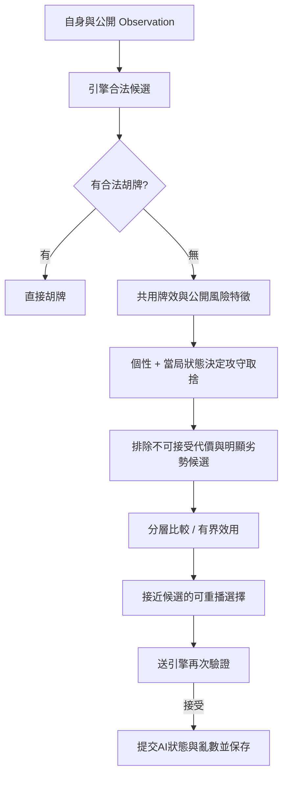

# 人性化 AI 玩家：設計主文件

2026-10-06。狀態：**後續擴充設計，尚未實裝**。使用者指定將進攻／防守牌風納入人性化 AI，以個性參數改變決策取捨；目前版本仍維持既有三位本地公平牌效 AI。桌規唯一來源為 [TW16-CLASSIC-v1](../taiwan-mahjong-m0/RULES.md)，不移植日麻振聽、立直或13張牌型。開發由6.1 Sol主導，Luna處理限定審查。

本文件決定玩法方向；[決策規格](HUMAN-AI-DECISION-SPEC.md)說明未來實作切面；[驗證方案](HUMAN-AI-VALIDATION.md)區分已有證據與待驗假設。[牌風研究](AI-STYLE-DESIGN.md)保留768副起手基準與安全反例。後續實作須另啟動工作包，不能把本次設計完成當成已發布功能。

## 要讓玩家感受到什麼

三位對手都會遵守規則、接受合法胡牌，但面對「快一步、保留好牌型、少冒險」的衝突，會有持續而可辨識的偏好。玩家可逐漸看出有人較願吃碰、有人弱手先守、有人願為有根據的較高價值保留彈性。不是用隨機失誤、假停頓或調整牌牆製造人性。

首版成功條件有三項，須各自驗證：

- **可信任**：不偷看、不非法、不改牌、存檔後可接續相同決策。
- **有個性**：在確實存在取捨的情境中，偏好跨局可辨認；不是每一步硬做出不同選擇。
- **仍會打牌**：個性有代價但有理由，不因追求辨識度而大量無效副露、無端拆手或放棄合法胡。

本案的人性化指遊戲行為的可信度，不宣稱模擬真人心理。勝率較高不必然比較像人，玩家認得角色也不必然代表牌技更好。

## 四層分工

| 層次 | 表示什麼 | 首版建議 | 不應混入 |
|---|---|---|---|
| 個性 | 穩定的取捨偏好 | 每位AI整將固定的小型參數資料 | 向聽算法的正確率、作弊權限 |
| 能力 | 分析品質與搜尋深度 | 三家先用相同分析器及固定計算預算 | 用低能力假冒謹慎或冒險 |
| 當局狀態 | 起手品質、當前進度、公開威脅及攻守模式 | 自身觀察計算的小量狀態，隨接受動作更新 | 從真實對手手牌判斷威脅 |
| 表現節奏 | 動畫與出手間隔 | 沿用現有節奏，之後可獨立改善 | 延遲長短改變反應優先或亂數結果 |

例如「快攻」不等於「愛吃碰」：低副露偏好也可追求快速門清。謹慎型拿到好牌仍可進攻；積極型面對高代價威脅也可退守。不同牌風不要求不同的每一手。

## 個性參數：先少而清楚

首版推薦四軸。高低只是偏好的方向，初始係數須經情境與對局校準，**不是已找出的最佳權重**。個性值推薦約定0–1，預設值與權重映射待校準；匯入值非有限數或超界時拒絕，不能靜默夾成另一個性。參數使用明確版本及已解析的值，不建通用特質樹。

核心設計為四軸，但最小離線試驗先啟用冒險容忍、副露偏好與調整意願；價值企圖待代理特徵驗過才啟用，不為尚未使用的特質先預埋程式欄位。副露軸只調失去門清／彈性的成本，價值軸調牌型方向的收益；同一份門清收益只能計一次。

| 參數 | 低值 | 高值 | 對應決策與限制 |
|---|---|---|---|
| 冒險容忍 riskTolerance | 願用牌效換較低放槍風險 | 願在有進攻收益時承擔較高相對風險 | 改可承受代價與反應強度；不改共同威脅判讀或軟切換確認時間，不等於喜歡危險牌 |
| 副露偏好 openness | 同等收益時保留門清與捨牌選擇 | 實質收益相近時較願吃碰／明槓 | 比較叫牌後合法捨牌；不另設反向「門清偏好」造成兩軸重複計分 |
| 價值企圖 valueAmbition | 優先速度與可達性 | 為有根據的牌型價值接受有限速度代價 | 先用可解釋的牌型潛力，不能把未完成牌型當已得台數；價值估計不可靠時降低此軸作用 |
| 調整意願 adaptability | 有依據的既定路線較持久 | 新資訊充分時較快調整攻守／目標 | 只改共同軟轉向條件成立後的確認／維持時間，不改風險代價或安全真值；明確危險可立即退守 |

「槓偏好」先列為條件修飾項：只有明／暗／加槓風險模型及收益比較成立後，才在接近的合法選項間調整。若與冒險容忍完全重複，就不新增第五軸。任何額外特質都要先證明能在其他參數固定時產生合理、可辨認的差異。

不先做憤怒值、記仇、信任玩家、虛張聲勢、學習玩家暗手或每步重抽性格。公開戰績對行為的影響可日後另設，不能因真人輸贏暗中補償、放水或提高抽牌機率。

目前公開捨牌／副露歷史已足夠支援當局反應，不先建立跨將的玩家側寫。日後若研究對手習慣，只能以公開行為、足夠機會分母與不確定性更新，不能把一次碰牌當固定性格或拿真實暗手作標籤回灌當局；是否需保存個人資料要另定範圍。

### 模板與同桌配置

下表是待校準的配置方向，預期行為是未來驗證目標，不保證每局或每手都可辨。所有模板共用相同特徵、候選、深度與計算預算；差異只在取捨與狀態持續性。

| 模板 | 冒險容忍 | 副露偏好 | 價值企圖 | 調整意願 | 預期可見行為 |
|---|---|---|---|---|---|
| 快攻門清 | 中高 | 低 | 低 | 中 | 追有效進張；叫牌收益不足時保持門清 |
| 積極副露 | 中高 | 高 | 低 | 中高 | 有實質改善較願吃碰；不為副露次數而無效叫牌 |
| 謹慎應變 | 低 | 中低 | 中 | 高 | 弱手或公開威脅升高時先顧風險，牌勢改善能回攻 |
| 耐心求值 | 中 | 低至中 | 高 | 中低 | 有可信牌型潛力時保留路線；不盲追已耗盡的牌 |

最小實作先驗「快攻門清、積極副露、謹慎應變」三個模板；耐心求值須等價值代理指標驗過，不能只加一個數字就宣稱有追台能力。首版可直接固定三席模板，座位在離線評估輪換。之後若加入新將隨機配對，使用獨立可保存的設定亂數，不取牌牆種子。

個性固定至一將結束；每局攻守狀態可以不同。暫不提供十多個玩家滑桿。若要加入個體微差，先限制在已驗範圍並保存解析後參數，不能只存模板ID後讓更新悄悄改變舊牌局。

## 決策管線

合法性、公平資訊與合法胡優先是硬限制，不能寫成可能被個性權重抵銷的扣分。自動補花及強制花胡沿用引擎。AI不得自行產生引擎沒有的吃碰槓胡選項。

先保留現行「最低向聽→最多公開有效張→同分亂數」作為進攻基線。新增策略先使用攻守分層與有界取捨；沒有放槍、價值與付款的校準前，不直接把向聽、張數、台數、風險相加，再宣稱最大期望得分。

個性差異必須出現在可接受候選中。進攻模式可以嚴格保牌效；防守模式須容許有理由地退向聽，否則所有個性永遠選同一張進攻牌。容許退步的界線是待驗策略設定，不是桌規。

## 弱起手與中途轉向

已有閒家補花後E16樣本768副，平均向聽4.198；向聽至少6占約10.16%。這是開發樣本的候選弱手門檻，**不是最大互斥搭數、實際玩家分布或最佳防守觸發**。莊家E17與首摸後最佳捨牌E16要另校準，不能混用。

建議以起手向聽及有效張作「牌差」的主代理；不宣稱這已等於精確搭數判斷。若後續堅持按最大互斥搭數分段，須先定面子／搭子／將的容量與重疊規則，再與向聽逐例比較；現有展示拆法不能替代該定義。

若要真正實現使用者的「起手低於平均而轉守」，未來必須在自己補花完成且未首摸時取得起手摘要，保存基準種類、起手向聽與有效張摘要即可，不重存整副手牌。只在首次E17決策看牌，不能反推原始E16；無存檔記憶的版本只能稱「依目前牌況保守」。

建議先使用進攻／均衡／防守三個模式，進入與退出條件分開。弱起手降低追牌意願，公開威脅及可承受損失決定是否實際退守；開局資訊不足時，不因弱手直接拆完手牌。回攻要求自身進度改善或威脅持續下降；明確危險出現可立即退守，不被個性慣性鎖住。

模式更新按接受的決策與實際新觀察進行，不能每次畫面重繪或AI預覽就累加確認次數。狀態與亂數需一起續存，重載不能把守勢清空。合法胡永遠接受，防守不是禁止胡牌的玩法。

## 台灣麻將的安全觀念

本案沒有日麻振聽。對手曾捨某牌、筋、同種數牌四張全見，均不能直接當作安全保證。四張3萬全在自己手中，別家仍可能用12萬胡3萬。公開資訊必須排除將、刻及所有合法順子路徑，才可證「本次一般放槍安全」；沒有證明只代表未知，不代表必放槍。

三家風險分別分析；對一家低風險不等於全桌低風險。暗槓牌種、他家過水、暗手與真實牌牆不可讀。風險模型未校準前只用相對風險與證據，不顯示放槍百分比。防守同時看放槍代價、保留安全候選及繼續進攻的機會，不追求「從不放槍但也從不胡」的退化策略。

## 吃碰槓要像完整決定

吃碰須與後續**全部合法捨牌**一起比較，計入禁捨、牌效、風險及失去門清／彈性；不能用愛副露的固定加分蓋過無效進張。防守型仍可叫牌，但要有可證明的避險或合理收益。叫牌實際是否取得由引擎優先序決定，後捨重新驗合法，不預先鎖定一張可能已不合法的牌。

明槓、暗槓、加槓分開建模。明槓本回合補牌禁一般自摸、加槓有搶槓窗口、暗槓種類對他家隱藏；補牌內容未知，不能用真實牆尾「算收益」。沒有可信收益分析時，現行固定槓加分只保留作對照；新策略試驗先用不主動槓的共同能力上限，不把舊加分帶進守勢或把槓偏好當已完成的槓最佳化。詳決策規格，正式功能仍須檢查此上限的代價。

## 如何讓玩家看懂

先以座位旁的簡短公開牌風名稱表示個性，說明「偏好會隨牌況調整」。不顯示對手即時向聽、聽口、私人起手好壞、真正攻守模式或由其暗手算出的理由；公開個性和公開出牌已足夠讓玩家認識對手。

真人教練只分析真人自己的Observation，風險提示按需展開，不每一步彈窗。日後若顯示「此牌已排除一般放槍」或「較低相對風險」，須區分證明範圍與估計；不能使用AI內部分析當全桌提示。結算可介紹牌風的一般理念，但不另造未公開資訊的回放功能。

出手速度與動畫可以獨立改善，不能讓反應較快的AI搶到較高優先權，也不能以等待時間消耗決策亂數。先把決策可靠、可辨認做好，再考慮表情或對話；首版不需要線上模型、API金鑰、神經網路或新依賴。

## 最小技術切面

沿用src/ai.ts的Observation入口及analysis.ts共用分析，Session負責呼叫、接受後提交及保存；規則引擎不認識「謹慎型」。未來公開安全分析可有一個小型純函式模組；個性為普通資料與少量評分／切換函式，不建立插件式策略框架。

現有Session v1只有game及三個aiRandom；decode會丟棄額外欄位。個性、策略版本與影響決策的狀態需明確升版與遷移，不能直接塞欄位。建議舊v1牌局固定使用現行基線直到結束，新將才選人性化策略；是否轉換既有存檔須另定規則。GameState仍保持凍結桌規，不為個性升規則版本。

同一Observation、個性、狀態、策略版本及亂數應得到同一決策；預覽、重繪、被拒絕或重複提交不消耗永久狀態。現有快照不是完整事件錄影，不能承諾跨策略版本逐手回放整將。

### 方法選擇與升級條件

下表是本案的工程取捨，不是各方法在所有遊戲的能力排名。

| 方法 | 本案用途與成本 | 建議 |
|---|---|---|
| 共用牌理＋有界偏好／少量狀態 | 可直接重用既有分析，純資料可解釋、保存與離線驗證 | 首選；先驗分層規則，需要折衷才加效用項 |
| 完整行為樹／通用策略插件 | 當前決策候選由引擎提供，額外框架增加流程與版本負擔 | 不先建立；未來行為層級真的超出少量狀態時再評估 |
| 有限未知牌展望／抽樣搜尋 | 可研究一步分析漏掉的後續收益，但需要可信未知模型、固定預算與新增亂數流 | 有強度不足的反例及效能餘裕才加入，不先猜對手真手 |
| 從真人資料學習角色 | 可學習較複雜的行為分布，需授權台灣16張資料、訓練與獨立評估 | 後續研究選項；本案尚無必要資料，不用日麻資料直接當台灣桌規 |
| 線上LLM逐步選牌 | 需額外服務、合法輸出驗證及失敗／續局處理，不能自然保證確定重播 | 不符合目前純本地與最少依賴方向；不作首版決策器 |

先問實驗指出缺的是什麼：風格不明顯，改特質作用與情境；牌技不足，改善共用分析；介面感受不流暢，改節奏與提示。不要用更重的方法同時解決三種不同問題。開發用Sol／Luna與遊戲本地AI是兩個概念。

## 後續實作順序（尚未啟動）

| 工作包 | 最少交付 | 啟動後的通過條件 |
|---|---|---|
| M6.1 公開安全與決策邊界 | 充分安全證明、相對風險證據、小型公平測試 | 無振聽誤用、三個反例及遮罩／邊界案例通過；未校準風險不冒稱機率 |
| M6.2 最小人性化試驗 | 同能力的三模板、攻守切換、吃碰整體比較、版本化保存 | 合法胡優先、極端參數／續局一致；共同情境有合理差異；舊牌局相容 |
| M6.3 對局及玩家評估 | 固定種子配對、座位輪換、未用過的驗證集與小規模盲測 | 公平及存檔零錯誤；報告淨分、胡／放槍、代價、風格辨認與延遲，不只勝率 |
| M6.4 可見牌風及發布 | 簡短牌風標示、真人可關閉的風險說明 | 不洩漏他家私有分析，窄畫面／操作回歸與正式網站驗收 |
| 更後續 | 耐心求值、有限展望、個體微差或節奏 | 前述不足有數據支持，才增加相應能力，不預造框架 |

Sol負責方案取捨、規則／資訊邊界、保存契約與整合；Luna限定分工為反例與遮罩案例、同觀察情境表、文件交叉檢查。若任務可由純資料／腳本驗證，不先使用高耗模型。一次只啟動一個工作包，每包落盤並更新HANDOFF。

## 研究參考與本案判斷

[Personality Reinforced Search](https://www.gameaipro.com/GameAIPro2/GameAIPro2_Chapter23_Personality_Reinforced_Search_for_Mobile_Strategy_Games.pdf)提供以特質改變決策偏好的遊戲案例；本案採用清楚偏好與分開調校的觀念，不複製其搜尋架構，也不把文中的腦模型比喻當心理學證據。

[The Challenge of Believability in Video Games](https://arxiv.org/abs/1009.0451)支持先定義可信行為及評估方式，而非把「更強」當成「更像玩家」。[MultiGAIL personas](https://arxiv.org/abs/2308.07598)提供從玩家資料學習角色的另一種路線，但本案尚無授權訓練資料與評估集，首版不採用該訓練架構。[Suphx](https://www.microsoft.com/en-us/research/project/suphx-mastering-mahjong-with-deep-reinforcement-learning/)是麻將不完全資訊方法背景，不能直接證明本案台灣16張策略有效。

四軸、模板、攻守管線、保存方案與工作包順序均為**本案設計建議**；是否比現行AI更強或更自然仍須未來實驗。固定門檻、權重、風險分數與效能目標只有在驗證方案通過後才可標為已驗。
