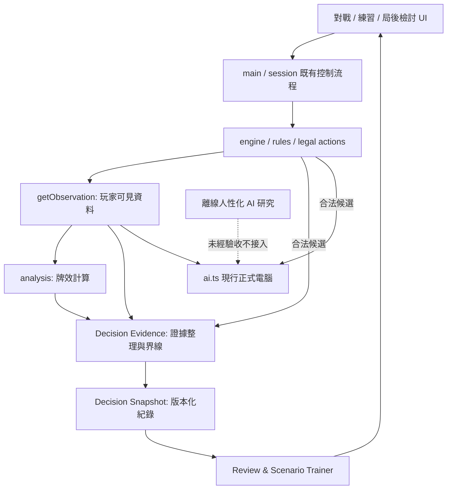

# 台灣 16 張麻將｜產品定位與技術調整方向報告

> **文件版本**：v1.0（接手審查建議稿）  
> **編製日期**：2026-10-09  
> **審查角色**：接手 PM（專案管理）＋SA（系統分析）  
> **專案性質**：既有單人麻將遊戲轉型為「進階玩家的麻將決策訓練工具」  
> **文件狀態**：**提案，尚未核准開發**  
> **現況來源**：使用者提供的 `PROJECT-REVIEW.md`（2026-10-08 版本）及本次對話中由專案負責人明確指定的產品目標。  
> **證據界線**：本報告未逐檔審查 GitHub 原始碼、`RULES.md`、其他設計文件或正式站即時狀態；凡涉及目前實作，均以現況底稿的記載為依據，並標示待驗證項目。

---

## 0. 給專案負責人的決策摘要

### 0.1 已明確決定的方向

1. **產品主要目的**：協助玩家提升台灣 16 張麻將牌技；不是單純開發可玩的麻將，也不是以 AI 技術研究為主要成果。
2. **核心訓練對象**：進階玩家。這裡的「進階」應按能力定義，而非僅按打牌年資定義。
3. **保留限制**：目前採固定桌規 `TW16-CLASSIC-v1`；所有分析、教學與驗收必須遵循該規則，不得將其誤稱為所有台灣麻將桌規的普遍最優解。

### 0.2 PM＋SA 的主要建議

**將下一階段的核心交付物從「更像真人的 AI 對手」，調整為「能提出可信證據、可供複查、可驗證學習成效的決策訓練系統」。**

採用兩條互補、但開發優先級不同的路線：

- **主線：情境式決策分析與訓練**。優先建立可解釋的牌效／安全證據、標準案例、無提示測驗及對局檢討。
- **輔線：完整對局驗證**。保留一位真人對三位本地電腦的遊戲，用於練習連續決策和評估訓練能否遷移到實戰；不以電腦人格研究作為第一交付標的。

**建議暫停原 M6 人性化 AI 的正式整合**。不是刪除研究或否定技術成果，而是要求先證明其對玩家學習目標的價值。既有 `safety.ts`、`risk-evidence.ts`、`strategy-comparison.ts` 保留為研究資產，通過證據驗收後才選擇性納入教學或正式 AI。

### 0.3 總體判斷

| 項目 | 判斷 | 原因 |
|---|---|---|
| 已有完整單人對局 | **保留** | 是可利用的實戰環境，不必重寫 |
| 共用牌效分析 | **保留並獨立驗證** | 有可利用基礎，但不能自證策略正確 |
| 純牌效練習 | **保留、重新定位** | 適合局部技能，不等於完整攻守訓練 |
| 對戰教練 | **重新設計呈現與評價語義** | 目前以一步牌效為主，不足以宣稱整體最佳 |
| 人性化四軸人格 | **暫緩正式化** | 目前沒有證據顯示其比決策檢討更能提升牌技 |
| 進階攻守與預期收益 | **分階段研究** | 危險率校準、牌值收益模型尚未完成 |
| 新手引導、鼓勵回饋 | **維護但降低投入** | 不應主導進階玩家版本 |
| 帳號、多人、雲端同步 | **本輪不做** | 偏離目前核心價值並引入後端成本 |

### 0.4 本報告的決策原則

- **功能有做出來 ≠ 玩家有學會。**
- **一步牌效較好 ≠ 整體策略最佳。**
- **沒有安全證明 ≠ 已知危險；有條件的安全證明 ≠ 整局零風險。**
- **電腦會這樣打 ≠ 教練可以判定玩家其他選擇錯誤。**
- **測試全數通過 ≠ 學習成效獲得驗證。**
- **研究成果通過局部牌例 ≠ 可安全接入正式對局。**

---

## 1. 專案現況與證據邊界

### 1.1 現況底稿已記載的事項

| 面向 | 底稿記載之現況 | 本次審查態度 |
|---|---|---|
| 已發布產品 | GitHub Pages 可遊玩；1 位真人＋3 位本地公平電腦，具完整行牌、結算、續局 | 視為既有資產，正式修改前仍須重新驗收 |
| 訓練相關 | 純練習、對戰牌效提示、六步新手教學、正向回饋 | 功能存在，但**尚無學習成效證據** |
| 現行電腦策略 | 以向聽、公開有效進張的一步牌效為主，合法胡牌優先 | 不應稱完整攻守 AI |
| AI 研究 | 四個人格軸與三個離線研究模組，**未取代正式 AI** | 保留，但需獨立驗收 |
| 研究限制 | 未校準放槍概率、沒有完整威脅推估、完整期望收益與自動攻守切換 | 不可在教練 UI 偽裝成已具備 |
| 資料保存 | 對戰及練習皆於瀏覽器本機保存，帶版本及還原檢查 | 必須維持相容與不丟檔保護 |
| 既有測試 | 底稿記載前包 278 項全通過、曾有桌面／窄版驗收 | 只是歷史證據，本報告未重跑 |
| 版本差異 | 底稿時點本機 `14870ee`、遠端 `57a0921`；最新離線包未推送 | **需要重新建立版本基準**，不能把歷史差異當作今日事實 |

> 來源：`PROJECT-REVIEW.md` 第 2–9 節。上述均為文件記載，不代表本次已透過 Git、CI 或瀏覽器重新核實。

### 1.2 不得變更的系統約束

1. `RULES.md` 才是完整、唯一的桌規依據；本報告不能替代花胡矩陣、過水、禁捨與互斥台表。
2. 現行規則為 `TW16-CLASSIC-v1`，包括 144 張（含 8 花）、固定牌尾 16 張、一般胡牌五面子加一對、莊胡或流局續莊等已定義行為。
3. 引擎是合法動作唯一來源；教練與 AI 僅使用指定玩家的 `getObservation`，不得讀取其他玩家暗牌、牌牆順序、種子或不可見暗槓牌種。
4. 既有存檔不得因訓練功能升版被清空、覆寫或暗中轉換為不可讀狀態。
5. 維持 TypeScript＋Vite＋原生 HTML/CSS＋純靜態部署，除非具體需求證明必須改變。
6. 不以技術重構、AI 改進或美術優化為由，默默改變桌規與收付邏輯。

### 1.3 本次不能確認的事項

本報告**無法確認**：實際函式簽名、程式耦合程度、CI 現在是否綠燈、正式站當前版本、未公開的真實玩家留存數據、手機與 Safari 實機品質，以及任何 AI 策略優於基線的統計結論。這些應列為接手後查證任務，而不是寫成已知事實。

---

## 2. 問題定義與核心風險

### 2.1 產品問題

目前有「能玩」、「能顯示牌效」、「可作純練習」，但缺少從**玩家決策 → 判斷理由 → 技能缺口 → 重複練習 → 無提示複測**的可驗證閉環。

所以專案目前更接近「附帶牌效輔助的麻將遊戲」，尚不足以證明已形成「進階麻將牌技訓練產品」。這是根據既有功能與缺少證據所作的審查判斷，**並非認定程式有缺陷**。

### 2.2 技術問題

- 牌效函式、電腦 AI、教練可能依賴共同分析邏輯；**共用程式碼有利一致性，但不等於互相驗證**。若把 AI 選擇當成教練標準答案，會有循環驗證風險。
- 目前正式策略偏重一步牌效；強行輸出「最佳出牌」「最安全捨牌」「放槍率 X%」「期望多賺 Y 分」將超出現有證據。
- 安全研究的充分證明應明示**對象、局面條件、證明範圍**；不能與未經校準的危險率混為一談。
- 若新增決策紀錄，可能遇到存檔版本、瀏覽器配額、跨分頁衝突、分析版本更新後不可重現等問題。

### 2.3 交付管理問題

- 舊 M6 的研究目標與新產品目標不完全一致。
- 原規劃中「人格更像真人」不等同「玩家會做出更好的決策」，需要重新論證優先性。
- 278 項測試保障既有邏輯的某些條件，沒有提供訓練成效的獨立證據。
- 本機提交、遠端 main、CI、正式網站應形成一組可追溯的版本關係，不能用歷史部署成功為未來版本背書。

---

## 3. 建議的產品定位

### 3.1 定位敘述

> **台灣 16 張麻將進階決策訓練工具**：協助熟悉基本桌規與向聽／牌效概念的玩家，在固定且清楚揭露的桌規下，練習牌效取捨、公開資訊判讀、攻守轉換與局況決策。以可驗證證據解釋選擇，並藉由情境訓練與完整對局檢討評估進步。

### 3.2 目標玩家的能力定義

**納入**：已能獨立完成一將、理解吃碰槓胡及主要台數計法、能理解基本向聽與有效進張，並希望補強決策理由的玩家。

**不以此為主要對象**：尚不懂牌型結構的新手、只想快速娛樂的玩家、期待真人連線競技或跨桌規求解的人。

**待驗證假設 H1**：相對於新增人格 AI，進階玩家更願意使用「自己打錯哪一步及為何」的分析功能。

**待驗證假設 H2**：情境訓練可提升玩家對**沒看過的局面**的判斷，而不只記住題庫答案。

**待驗證假設 H3**：完整對局作為驗證環境，比單純增加題庫更能揭露局況轉換的能力缺口。

### 3.3 產品優先順序

1. **可信**：不誤導；每一個主張有證據界線。
2. **可學**：玩家看得懂不同選擇造成的代價。
3. **可量測**：能用無提示新題，檢查能力有沒有變化。
4. **可實戰**：學習能在完整對局中運用。
5. **好玩與有個性**：保留基本體驗，但不凌駕以上目標。

### 3.4 產品工作（Job to Be Done）

- 「我知道這一手能進聽，但想知道為什麼仍可能需要保留安全張。」
- 「我打完這局，不只想看輸贏，而是想知道哪些時刻值得重新思考。」
- 「我希望在沒有人提示的情況下，能在陌生局面比較出合理的攻守選擇。」

---

## 4. 產品路線比較與建議決策

| 路線 | 主體 | 優勢 | 風險 | 建議 |
|---|---|---|---|---|
| A. 遊戲優先 | 強化電腦、演出、人格 | 延續目前遊戲資產、娛樂性較直接 | 教學價值容易被間接化；AI 評價不易驗證 | **不選為主線** |
| B. 分析優先 | 題庫、牌效、安全證據、檢討 | 能直接驗證特定能力 | 缺少連續對局與真實壓力 | **主線** |
| C. 雙軌但訓練優先 | B 為主，保留既有完整對局 | 保有實戰遷移驗證；重用成熟引擎 | 若沒有範圍管制，可能兩邊都做不完 | **推薦** |

**建議：C 的分配方式是「B 的交付優先、A 的既有功能保留」，而不是同時開發 B 與新一代 A。**

### 4.1 反對的捷徑

- 不先開發龐大的人格參數 UI，然後寄望其自然產生教學價值。
- 不先做所有局面的放槍率／預期收益估計，然後把未校準的數字呈現為教學真相。
- 不把所有捨牌都強制轉換成 0–100 的「絕對正確分數」。
- 不以短期勝率或總點數唯一判斷學習是否成功；牌運與對手強弱會干擾。

---

## 5. 功能範圍重整

### 5.1 保留、改造、延後、移出

| 既有／擬議功能 | 決策 | 工作內容 | 理由 |
|---|---|---|---|
| 完整單人對局、結算、續局 | **保留** | 維護既有行為，作為實戰環境 | 投入已形成資產 |
| 現行電腦策略 | **保留基線** | 固定作對照組；暫不接人性化研究 | 避免訓練產品與 AI 同時劇變 |
| 共用牌效運算 | **保留並驗證** | 獨立案例驗算、版本標示 | 是分析基礎而非策略真理 |
| 現行純練習 | **保留、重新標示** | 明確命名「基礎／進階牌效練習」，不宣稱防守教學 | 適用範圍有限 |
| 對戰教練 | **改造** | 先顯示局部證據、備選差異與限制；可選擇延後檢視 | 避免答案依賴 |
| 決策快照與賽後檢討 | **新增核心** | 保存關鍵時點可見局況、合法選項、分析版本 | 補足反思閉環 |
| 情境題庫與無提示測驗 | **新增核心** | 以已驗證題目測試知識遷移 | 能直接驗證學習成果 |
| 安全證據研究 | **局部採納** | 僅已證明邊界明確的指標可進正式分析 | 防止誤把未知當危險 |
| 四軸人格與自動攻守切換 | **暫緩** | 保留文件與離線程式，不接正式策略 | 尚無用戶價值與對局證據 |
| 阻莊權重模型 | **延後** | 作研究案例；先訂收益目標，再評估 | 可能與自身收益衝突 |
| 長期期望收益引擎 | **不納入首版** | 等建立風險、牌值及局況模型再立項 | 目前缺少可信依據 |
| 新手教學、正向回饋 | **維護不擴充** | 修缺陷即可；避免把事件鼓勵當作策略正確性 | 非首要客群 |
| 完整局面回放／分支模擬 | **延後** | 先做「一個決策的靜態比較」 | 成本與資訊公平風險較高 |
| 成就任務、等級、帳號同步 | **移出本輪 Roadmap** | 不刪既有功能，只不新增 | 與當前目標連結薄弱 |
| 真人連線、課金、跨桌規 | **本輪不做** | 如需重啟須重新立案 | 會改變技術與產品定位 |

> 「移出／暫緩」表示不納入近期交付範圍，**不是要求刪除目前程式碼或研究資料**。

### 5.2 最小可用教學版本（MVP）

**只做三件玩家可見的事：**

1. 在特定決策後，能看見 2–3 個合法選項的可驗證差異。
2. 在局後能回看少量關鍵決策，不必先支援完整錄影／牌局回放。
3. 能完成一組陌生題目的無提示測驗，得到按能力維度拆分的回饋。

**暫不做**：完整放槍率、預測對手聽口、全面最優策略、人格 UI、跨裝置學習履歷、所有局面的自動強制評分。

---

## 6. 必要功能需求（需求層級）

所有需求均為**新規劃**，並非宣稱已完成。

### FR-01｜決策分析證據

- 輸入：規則版本、玩家當時可見的觀察、引擎提供的合法動作、分析器版本。
- 輸出：對各合法候選動作可計算的指標及說明，例如向聽、公開有效進張、採用的分母與計算條件。
- 提示必須區分：**「牌效較優」**、**「在特定範圍內有安全證明」**、**「證據不足，無法比較整體優劣」**。
- 不得以牌效排序推導出「整體最安全／最高收益」的宣稱。
- 禁止讀取完整 `GameState` 以取得玩家不可見資訊；需要對局內其他狀態時必須經明確審核與轉換。

**驗收**：獨立牌形案例與合法動作案例全數符合凍結規則；任何結論都能追溯至明確的資料欄位及演算法版本。

### FR-02｜候選動作比較

- 對捨牌、可驗證的吃碰後出牌進行比較；合法候選來自 engine，不在 UI 自行補造。
- 每項比較至少區分「已知可計算差異」與「尚不具備模型的因素」。
- 不強制產生單一冠軍選項；存在多個可接受選擇時要明示。
- 在相同局況與分析版本下，結果必須可重現；若出現同分，須有穩定且公開的呈現規則。

**驗收**：候選清單與引擎合法選項一致；沒有不合法推薦，也不以 AI 既有選擇充當唯一正解。

### FR-03｜關鍵決策快照

- 僅在玩家需要評估的決策點建立快照，例如關鍵捨牌、吃碰選擇、攻守衝突案例；不預設要保存所有動畫／影格。
- 快照至少記錄：規則版本、可見局況表示、合法選擇、玩家實際選擇、分析器版本、可重現識別碼。
- 優先以既有 session／observation 的**受控資料轉換**取得快照，不從任意全域狀態抄取。
- 設定儲存上限、刪除方式與失敗回退；存檔容量不足時不可破壞既有對局保存。
- 若某次決策因資訊或版本不足不能評估，顯示「無法檢討」原因，而非提供猜測。

**驗收**：跨重新整理後能讀取；舊存檔不受影響；異常、衝突、容量不足時資料安全。

### FR-04｜局後決策檢討

- 顯示當時看得到的資訊、玩家原始選擇、其他合法候選與可驗證差異。
- **不得用後來翻出的暗牌、最終輸贏或牌牆順序，倒推當時玩家「一定選錯」**。
- 允許標記「牌效取捨」、「公開安全」、「證據不足」等類型。
- 先支援少量代表性決策；不承諾完整牌譜或互動式未來分支。

**驗收**：使用者可在不知後續結果的條件下理解選項差別；分析不含未授權私有資訊。

### FR-05｜情境題庫

- 題目以特定能力設計：同向聽牌效比較、保留安全張的代價、莊／閒局況資訊判讀、副露與門清取捨等。
- 每題附：明確條件、評量能力、可接受答案集合／判斷規準、解釋、資料來源與審核狀態。
- 無可信唯一解的題目，可用「指出取捨與限制」取代單選題。
- 題庫應有訓練集與保留測試集；避免相同題序、同一亂數牌序造成背答案。

**驗收**：每題可追溯依據；未經審核不得納入正式評分；測試集不在教學階段揭露答案。

### FR-06｜無提示能力測驗

- 前測／後測使用難度匹配、但未重複呈現的題目。
- 依能力維度回報結果，不直接宣稱已提升「整體勝率」。
- 對具有多個合理答案的題目，根據推理要點或接受範圍評分，不任意判錯。
- 初期可採人工整理或本機儲存；**不為追蹤指標而先蓋後端**。

**驗收**：能區分對原題的熟悉度與對新局面的判斷改善；成效報告標示樣本限制。

### FR-07｜提示模式

- 可在「不提示」、「決策後解釋」與「即時輔助」之間選擇；首要評量只使用不提示模式。
- 模式變更不可造成多走一手、跳過真人回應、重複結算或存檔衝突。
- UI 表達「選項優劣的適用範圍」，不以單一大分數掩蓋限制。

**驗收**：三種模式切換前後規則與進度保持一致；手機／窄畫面資訊不遮擋關鍵操作。

---

## 7. 教練輸出的證據等級與用語規範

### 7.1 建議的證據等級

| 等級 | 可用內容 | 允許表述 | 禁止表述 |
|---|---|---|---|
| E1：確定性 | 合法性、固定桌規、可獨立驗證之向聽或計數 | 「此選項的向聽數為……」 | 沒有推導直接稱「必勝」 |
| E2：條件充分證明 | 在公開容量等條件成立時的指定安全結論 | 「依目前公開資訊，對指定對手可排除某類普通放槍路徑」 | 「保證整場不放槍」 |
| E3：局部策略比較 | 在明示目標、門檻或權重下的候選偏好 | 「若優先保持聽牌，A 較符合此目標」 | 「A 的全局收益一定最高」 |
| E4：尚未校準的推估 | 危險排序、對手威脅、長期期望收益（目前未成熟） | 「研究中，不作正式評分」 | 未經校準就提供百分比、精確分數 |

所有 E1–E3 指標在進正式 UI 前，仍須通過各自的案例、條件與顯示語句審核。

### 7.2 指標解釋的常見陷阱

- **向聽數**是牌形結構距離指標，不是「預計幾回合後一定胡牌」。
- **公開有效進張比例**依特定可見牌與分母計算，不等於真實剩餘牌牆中的摸牌機率。
- **安全證明**依據條件成立及涵蓋的成形路徑，不可擴張到全部胡牌事件、整局或所有對手。
- **缺乏安全證據**不代表牌必然危險。
- **對莊權重**是策略偏好而非放槍機率，且流局在本桌規中也可能讓莊家續莊。
- **示例拆牌**若並非最優拆法證明，就只能稱示例，不可稱唯一正確答案。

### 7.3 具體教學輸出示例（非真實演算結果）

> **可驗證牌效**：選項 A 保留聽牌；選項 B 會使牌效退一步。  
> **安全證據**：選項 B 對特定對手符合目前的公開安全證明條件；A 尚無同等證明。  
> **尚無法判斷**：目前不能把這些證據換算成兩項選擇的完整期望得分排名。  
> **學習重點**：比較進攻機會與可證明的退守選擇，並指出還欠缺哪些局況資訊。

這種輸出比「打 B：95 分；打 A：82 分」更符合現階段能力，也較不會誤導進階玩家。

---

## 8. 建議技術架構與資料契約

### 8.1 架構原則

- 不新增後端與執行時相依套件作為前提。
- 不重寫現有 `engine.ts`、`session.ts`、`analysis.ts`、`ai.ts`；先透過受控介面新增**薄型分析證據層**。
- 對局合法性、教練證據與 UI 呈現分離。
- 只有必要的決策事件需要快照；先限制大小，再評估擴充。
- 研究性策略與已正式驗證的教學邏輯分開，避免研究結果直接介入玩家對局。

### 8.2 建議責任分層



> 示意圖表示**建議的責任關係**，不是目前已存在的實際呼叫圖；程式實際介面與檔名需經原始碼查核後再定案。

### 8.3 概念資料契約（非可直接套用的程式型別）

```ts
interface DecisionSnapshotV1 {
  schemaVersion: 1;
  rulesVersion: string;       // e.g. TW16-CLASSIC-v1
  analyzerVersion: string;
  decisionId: string;
  // 必須為受控、已過濾的「當時玩家可見資訊」序列化格式
  observation: unknown;
  legalActionIds: string[];   // 依實際 engine API 確認
  chosenActionId: string;
  createdAt?: string;         // 僅供本機回顧，不作遊戲決策依據
}

interface EvidenceItemV1 {
  actionId: string;
  metric: string;
  value?: number | string;
  evidenceLevel: 'E1' | 'E2' | 'E3' | 'E4';
  scope: string;              // 適用對手、規則或條件
  assumptions: string[];
  explanation: string;
  status: 'supported' | 'conditional' | 'unknown';
}
```

此契約只用於促進 SA／RD 討論；**不能在未檢查現有型別與隱私界線前直接實作**。尤其 `observation: unknown` 在落地時須替換為嚴格白名單型別與驗證器，不得把任意物件直接落盤。

### 8.4 分析紀錄與存檔的分離

- 維持既有 `tw16:TW16-CLASSIC-v1:save`（Session／GameState v1）、`tw16:practice:v1` 與 `tw16:coach:v1` 的既有語意。
- 建議分析資料使用**新的獨立鍵與 schema 版本**，不可假設既有對局存檔能容納訓練履歷。
- 舊存檔仍應按 `decodeSession` 與引擎 `restore` 路徑還原；不可單靠 `JSON.parse`。
- 要修改練習的發牌或演算法時，應另評估以種子與捨牌日誌重播的相容問題。
- 針對瀏覽器儲存容量不足、毀損、多分頁衝突與跨網域不共用資料等既有限制，需列出清楚的 UX 回饋與復原程序。
- 未來若支援匯出，需先設計驗證、版本、檔案大小上限與敏感資訊過濾；本版不承諾匯入匯出。

---

## 9. 使用流程設計（先可驗證、後自動化）

### 9.1 練習主流程

1. 玩家選擇能力主題（例如：同向聽進張比較）。
2. 系統出一題**已審核**的可見局況，要求先獨立作答。
3. 玩家提交選擇，系統揭露多個選項的可驗證差異與限制。
4. 玩家完成同能力、但牌形不同的新題，避免只記憶答案。
5. 一組題目完成後，以不同能力面向顯示尚需補強的部分。
6. 後續安排未見過的新題無提示複測。

### 9.2 完整對局的檢討流程

1. 玩家選擇「不提示」或「決策後解釋」；系統不擅自改變原本的遊戲規則與操作。
2. 在受限且可審核的決策點，保存觀察快照和實際選擇。
3. 對局結束後顯示 3–5 個具有**分析價值**的決策案例（首版可固定挑選規則，而非聲稱已能找出真正的『最重大錯誤』）。
4. 玩家比較當時可知的選項；系統明確說明哪些是確定差異、哪些無法判斷。
5. 將相關能力連結至情境訓練，不以輸贏作為是否答對的唯一標準。

### 9.3 不應提供的體驗

- 即時顯示對手真實聽口、暗槓實際牌種或牌牆未來順序。
- 因牌局後續結果不佳，就將當時合理的選擇評為錯誤。
- 每一步都跳出強制教學視窗，破壞真人出牌節奏。
- 用聲光回饋強化未經評價的「進攻一定比防守好」觀念。

---

## 10. 成效衡量與實驗設計

### 10.1 北極星指標（North Star Metric）

**無提示、未見過局面的決策品質改善**，且必須限定在本版明確教學、可獨立評分的能力上。

不直接使用「整體勝率」、「每將贏多少分」或「AI 推薦一致率」作為唯一指標。這些可能反映牌運、對手強弱或與模型偏好一致，而不是實際學會。

### 10.2 指標定義

| 類型 | 指標 | 定義／注意事項 |
|---|---|---|
| 核心學習 | 未見新題正確／合理判斷率 | 以獨立審核的答案集合或評分規準計算；有爭議題不納入單一正確率 |
| 能力拆解 | 牌效、安全證據、局況取捨分項表現 | 各題只評量已具備證據的能力 |
| 認知品質 | 能否說出選擇理由與證據不足處 | 首輪可人工標記，不急著做自動語意評分 |
| 行為遷移 | 正式對局無提示狀態下，受測決策類型是否改善 | 控制題型和對手環境，避免只看勝率 |
| 信任護欄 | 不合法建議、洩漏私有資訊、錯誤安全宣稱 | 重要缺陷容忍度為零 |
| 技術護欄 | 存檔損失、重複結算、無法還原 | 重要缺陷容忍度為零 |
| 體驗輔助 | 完成率、理解度、提示關閉比例 | 用來找 UX 問題，不直接視作學習成效 |

### 10.3 建議的首輪驗證方案

- **題庫**：先製作至少 60 題經審核案例，分配到不同能力及難度；數量是提案起點，不是保證測量有效的科學門檻。
- **專家審核**：可確定計算的案例使用獨立演算法／人工牌形證明驗算；涉及策略歧義的題目至少保留理由、接受條件及爭議標記。
- **先導試用**：建議 6–10 名符合能力定義的玩家進行可用性與理解度訪談；此規模**不足以宣稱普遍有效**。
- **前後測**：使用難度匹配但未見過的題目，記錄分項表現；盡可能對照未使用教學的基準組或交叉試驗。
- **決策門檻**：先要求未出現重大誤導與資料錯誤，且觀察到可重複的改善訊號；如要對外主張學習效果，另規劃樣本量及統計檢定，不能只用少數人的平均分數推論。

**不提前設定**「使用三天後一定提升 X% 勝率」或「放槍率下降 Y%」等沒有基線支持的 KPI。

---

## 11. 驗收策略：正確性、可信性、學習性分開驗收

### 11.1 技術驗收矩陣

| ID | 驗收類型 | 必驗內容 | 通過條件 |
|---|---|---|---|
| AT-01 | 規則回歸 | 固定桌規、合法動作、計台、續莊、花胡、牌尾 | 既有測試與新增規則案例均通過；不得引入已知回歸 |
| AT-02 | 牌效正確性 | 向聽、有效進張、分母、重複牌與公開張數 | 對獨立標準案例 100% 符合預期 |
| AT-03 | 安全語義 | 安全證據對象、適用條件、未知狀態 | 0 件把未知說成危險、局部安全說成全局安全的重大誤導 |
| AT-04 | 資訊隔離 | 教練、AI、快照不得讀對手私有資訊 | 0 件越權資料欄位或暗牌洩漏 |
| AT-05 | 合法建議 | 候選及實際可執行動作一致 | 0 件推薦引擎判定非法的動作 |
| AT-06 | 可重現性 | 相同局況＋規則版本＋分析器版本 | 確定性證據及排序穩定一致 |
| AT-07 | 存檔相容 | 舊檔還原、異常拒載、跨分頁、容量不足 | 0 件靜默刪檔／覆寫／重複付款 |
| AT-08 | 操作 | 出牌預覽、吃碰槓胡回應、暫停、提示展開 | 無阻斷正常對局之問題 |
| AT-09 | 裝置 | 桌面、窄畫面、實際支援之瀏覽器 | 完成指定實機／瀏覽器手測，不以 320/390 模擬取代所有實機 |
| AT-10 | 發布 | Git commit、Actions、產物及正式站 | 版本一致、建置成功、指定冒煙案例通過 |

### 11.2 必須保留或新增的代表案例

1. **既有回歸**：134 牌型遇上家 2，可出現合法 13／34 吃法（依 `RULES.md` 與現有案例核對）。
2. **安全範圍**：三萬維持聽牌、對莊具安全證明；一筒對三家有證明但退出聽牌的既有研究情境，應用來驗證**系統不武斷給出全局唯一正解**。
3. **阻莊衝突**：避免放槍給莊，卻可能因流局讓莊家續莊；證明教練不把「安全」偷換為「一定阻莊成功」。
4. **資訊公平**：同一玩家可見局況、不同不可見牌配置時，教練不得洩漏不可見差異；在純可見證據模型下應呈現一致結果。
5. **存檔中斷**：在真人待答、局後彈窗、分析快照寫入失敗與跨分頁競爭時，檢查能否安全恢復。
6. **結算一致**：回看同一局或重開彈窗，不得重新計台付款。
7. **訓練公平**：訓練時看過的題，不得混入標示為全新無提示測驗的測試集。
8. **未知模型**：沒有概率校準時，UI 不應顯示具體放槍百分比或聲稱整體期望收益最優。

### 11.3 學習驗收矩陣

| ID | 問題 | 建議檢查方式 | 不通過的例子 |
|---|---|---|---|
| LT-01 | 玩家知道為什麼某動作牌效較佳嗎？ | 盲測新牌型、請玩家說明理由 | 只會照推薦牌打，不能說明 |
| LT-02 | 玩家能識別安全證據的界線嗎？ | 提供對莊／對閒不同證據 | 把對單一對手安全視為全桌安全 |
| LT-03 | 玩家知道哪些題沒有唯一最佳解嗎？ | 多方案攻守情境 | 將權重偏好誤認客觀概率 |
| LT-04 | 玩家能遷移到完整對局嗎？ | 不提示對局的指定決策抽樣評估 | 只在原練習題有進步 |
| LT-05 | 教練是否建立錯誤自信？ | 訪談／觀察分析說明被如何理解 | 將「有效進張比例」誤認真實摸牌率 |

---

## 12. 新階段 Roadmap：以「L」前綴避免覆蓋舊 M6 歷史

由於底稿已用 M6／M6.1 指稱人性化 AI 研究，而該階段尚未整體完成，**不建議直接把舊 M6.1 改名為新訓練功能**。建議使用新工作線 `L`（Learning），保留舊研究歷史與未完成狀態。

| 階段 | 交付目標 | 主要產物 | 進入下一關條件 |
|---|---|---|---|
| **L0｜基準確認** | 建立「目前真正能交付什麼」的版本與測試基準 | commit／CI／站台對照、現有能力矩陣、風險缺口 | 版本與範圍無歧義 |
| **L1｜可信證據** | 可在限定案例中正確解釋牌效及公開安全 | 獨立案例、證據格式、條件與限制語句 | AT-01～06 通過 |
| **L2｜決策檢討 MVP** | 能保留少量決策並於賽後檢視 | 快照、候選比較、局後 UI | AT-07～09 通過，無資料損失 |
| **L3｜情境訓練 MVP** | 題庫＋無提示測驗＋可解釋回饋 | 已審核題庫、評分規準、分項結果 | LT-01～03 及題庫審核通過 |
| **L4｜玩家驗證與收斂** | 確認可用性與學習改善訊號 | 試用報告、缺陷清單、指標分析 | 完成 LT-04～05；形成下一階段決策 |
| **L5（條件式）｜攻守研究再立案** | 評估是否需要校準風險及人性化對手 | 新 PRD、模型驗證計畫、AI 對局基準 | 由 L4 證據決定，**非自動開工** |

### 12.1 各階段刻意排除的事項

- L0 不開發新功能、不自行推送研究包。
- L1 不承諾完整最優策略或放槍百分比。
- L2 不做完整對局回放、可任意改寫歷史的分支模擬。
- L3 不做玩家能力排行榜、獎勵貨幣或帳號雲端。
- L4 不以小樣本證明普遍有效。
- L5 不因存在既有研究檔案就自動核准上線。

### 12.2 建議開工順序與依賴

```text
L0 版本與需求基準
  └─ L1-A 規則／牌效／安全證據獨立驗證
       └─ L1-B 分析資料契約與用語
            ├─ L2-A 決策快照與安全儲存
            │    └─ L2-B 賽後靜態比較 UI
            └─ L3-A 已審核情境題庫
                 └─ L3-B 無提示測驗
                      └─ L4 真人試用與成效檢驗
```

不建議先做 UI 再反推指標；先建立能被可信驗證的答案與證據，否則容易將錯誤模型包裝得更精美。

---

## 13. 可直接拆票的優先工作清單

| 票號 | 優先級 | 工作項目 | 依賴 | 完成定義 |
|---|---|---|---|---|
| L-001 | P0 | 查核本機／遠端／CI／正式站版本 | 無 | 統一記錄對應 commit，標示未部署差異 |
| L-002 | P0 | 盤點 `RULES`、`CONTRACTS`、現有測試與分析 API | L-001 | 規則—實作—測試追溯清單 |
| L-003 | P0 | 建立可信牌效與安全案例 | L-002 | 可獨立核對的案例與正確預期 |
| L-004 | P0 | 訂定教練證據分級、禁止用語、未知處理 | L-003 | 文案／數值／限制審查通過 |
| L-005 | P1 | 定義決策快照白名單型別及版本 | L-002 | 不含暗牌／不可見資訊；有驗證器 |
| L-006 | P1 | 建立快照的保存、失敗回退與容量限制 | L-005 | 舊存檔相容、跨分頁與容量案例通過 |
| L-007 | P1 | 局後呈現少量決策的靜態比較 | L-004、L-006 | 玩家能理解選項差別而不洩漏私有資訊 |
| L-008 | P1 | 製作並審核能力分類題庫 | L-003、L-004 | 題目、答案集合、理由、適用條件齊全 |
| L-009 | P1 | 實作無提示前後測及分項回饋 | L-008 | 訓練題與測試題隔離，評分可追溯 |
| L-010 | P1 | 進階玩家試用、紀錄理解落差 | L-007、L-009 | 可用性缺陷與學習初步結果報告 |
| L-011 | P2 | 依證據評估正式攻守 AI／人格模型 | L-010 | 有獨立 PRD 與收益／風險評估才排期 |

> P0/P1/P2 是**審查建議**，不是既有工單狀態。工時、日期及指派需由實際程式碼盤點後估算，避免虛構交期。

---

## 14. 專案風險登錄表

| ID | 風險 | 嚴重度 | 早期訊號 | 降低風險措施 |
|---|---|---|---|---|
| R1 | 教練把局部牌效稱作整體最優 | 極高 | UI 出現沒有條件的「最佳」 | 證據分級、文案審核、負向案例 |
| R2 | 公開安全證據被誤解成放槍率 | 極高 | 未校準仍顯示風險百分比 | 禁止假精確值、提供明確適用範圍 |
| R3 | 分析讀到對手暗牌或未來牌牆 | 極高 | 從全域狀態任意做快照 | 白名單觀察契約、資訊隔離測試 |
| R4 | 新訓練資料破壞既有存檔 | 極高 | 共用舊鍵、升版後拒載 | 版本獨立、相容測試、失敗保留原始資料 |
| R5 | 題庫「教會背答案」 | 高 | 舊題分數漲，新題無改善 | 訓練／測驗隔離、陌生題複測 |
| R6 | 玩家把 AI 選擇當成標準答案 | 高 | 推薦理由只有「電腦會這樣打」 | 獨立規則與策略審核、允許多個合理解 |
| R7 | 對手太弱導致學習偏差 | 中高 | 玩家只會利用既有 AI 習慣 | 學習主指標以獨立題為主；對局採輔助證據 |
| R8 | L 線與原 M6 研究同時擴張 | 高 | 同一版本同時加人格、教練、存檔 | Gate 管制、研究不自動併正式 |
| R9 | 正式發布與程式版本不一致 | 高 | 僅引用舊 Actions 成功紀錄 | 每次部署記 commit、CI、資源與冒煙結果 |
| R10 | 進階玩家不信任解釋 | 中高 | 常指出例外、關閉建議 | 先導試用、異議紀錄、證據可追溯 |

---

## 15. 變更管理、品質關卡與發布

### 15.1 五個必要 Gate

- **G0｜定位與範圍確認**：專案負責人已選定「進階玩家牌技提升」；仍需核准本報告所提的核心 MVP、延後清單與成功指標。
- **G1｜規則與證據可追溯**：至少核心牌效／安全案例通過獨立驗證；禁止文案與未知結果處理已定義。
- **G2｜資料與合法性安全**：資訊公平、存檔相容、跨分頁、失敗回退及結算一致性符合硬性門檻。
- **G3｜產品可用性**：玩家能完成練習、對局檢討、無提示測驗；指標和解釋被正確理解。
- **G4｜發布可追溯**：此次指定提交的 check／test／build、Actions 與正式站冒煙一致；留存可回復版本。

### 15.2 必須維持的開發／部署紀律

1. 從既有專案工作目錄執行 `npm ci`、`npm test`、`npm run build`，並依實際 `package.json` 確認其他 check 指令。
2. 如需用 `npm run dev -- --port 4183` 進行隔離測試，先確認來源、連接埠和本機儲存鍵，不覆蓋既有測試／正式存檔。
3. 不直接修改 `dist`／`site` 產物；由版本化原始碼建置。
4. 上正式前固定 commit 與驗收紀錄；發布後核對對應 Actions、HTTP 資源、實際操作與存檔還原。
5. 若發生重大回歸，**程式回退與資料回復必須分開思考**：部署舊版不保證新版儲存資料可被舊程式讀取。未經兼容性驗證不得承諾一鍵回退。
6. 重要文件同步更新 `ROADMAP.md`、`HANDOFF.md` 與必要的規則／訓練文件；保留原 M6 研究的歷史狀態。

### 15.3 不採行的大型重構

除非 L0 查證有實際缺陷，否則不進行全引擎重寫、全套狀態管理框架替換、為未來多人遊戲預建後端或因新增分析而拆分成大量通用抽象層。

---

## 16. 權責、文件與變更決議

### 16.1 建議分工

| 角色 | 主要責任 | 不得跳過的審查 |
|---|---|---|
| 專案負責人／PO | 決定教學對象、範圍、資源與取捨 | 功能是否真正解決學習問題 |
| PM | 工作拆票、Gate、變更紀錄、版本發布協調 | 未經核准不得將研究變正式需求 |
| SA | 規則追溯、決策證據契約、測試矩陣 | 資訊公平、證據界線、版本相容 |
| RD／開發 Agent | 最小實作、單元／整合測試、報告變更 | 不擅改規則、不跳過驗證 |
| 測試／牌理審核者 | 獨立案例、反例、可用性檢驗 | 不以開發中同一模型自證正確 |

一人或 AI Agent 可兼任多個角色，但**獨立驗證的功能不可只靠同一套實作邏輯自我證明**。

### 16.2 建議文件更新順序

1. `PROJECT-REVIEW.md`：保留現況快照，新增「方向變更決議」連結；**不覆寫歷史敘述**。
2. `ROADMAP.md`：保留 M0–M5.4 與原 M6 研究歷史，加入 L0–L4 與 Gate。
3. `TRAINING-DESIGN.md`：改寫訓練對象、學習閉環、題庫與評分邊界。
4. `HUMAN-AI-DESIGN.md` 等研究文件：標註「保留研究、未上線、重新評估優先級」。
5. `CONTRACTS.md`／新增適當契約文件：定義玩家可見觀察與決策證據格式；實際型別須回查程式。
6. `HANDOFF.md`：明示當前正式版本、未推送研究、當前 Gate 及下一個最小交付包。
7. `DEPLOYMENT.md`：增補快照／新資料鍵的回退與相容檢查。

---

## 17. 專案負責人仍需核准的決策

以下不是要求重新回答已選定的「核心目標」或「核心玩家」，而是完成需求變更必要的具體決策。

| 決策編號 | 提案預設值 | 如果不接受，需明確定義 |
|---|---|---|
| D-01 | 以「情境分析＋無提示測驗」為開發主線 | 是否仍以完整 AI 對局優先，以及理由 |
| D-02 | 現有對局保留作實戰環境 | 是否需要提高電腦強度至可用門檻；測量依據 |
| D-03 | 不在首版提供放槍率／長期期望值的精確數字 | 可採用模型的驗證證據與誤差標示 |
| D-04 | 原四軸人格 AI 暫緩正式整合 | 何種學習需求必須依靠人格 AI 才能解決 |
| D-05 | 桌規維持 `TW16-CLASSIC-v1` | 若擴桌規，另編版本及相容規劃 |
| D-06 | 初版桌面優先，窄畫面保持可用；正式支援裝置須列明 | 需要哪些手機／瀏覽器完成實機驗收 |
| D-07 | 本機保存、無帳號、無後端 | 需要跨裝置追蹤的真實使用情境與成本 |
| D-08 | 訓練效果先以無提示新題驗證 | 如以實戰勝率為主，須定義控制組與樣本設計 |

**建議核准順序**：D-01、D-03、D-04 優先；其餘可於 L0 完成程式與使用情境盤點後定案。

---

## 18. 開工前 10 項檢查清單

- [ ] 釐清正式站、遠端、工作區 commit 與 CI 的最新對應關係。
- [ ] 查閱完整 `RULES.md` 與測試，不以本報告桌規摘要直接改程式。
- [ ] 清楚列出目前教練指標哪些屬 E1／E2／E3／E4。
- [ ] 確認 `getObservation` 的實際欄位與公平性邊界。
- [ ] 釐清 `analysis.ts`、`coach.ts`、`ai.ts` 共用邏輯及耦合位置。
- [ ] 對既有研究的安全證明補充限制條件與反例測試。
- [ ] 定義第一版題庫涵蓋能力、評分規準與題目審核方式。
- [ ] 定義決策快照資料大小、版本、保存失敗行為與刪除方式。
- [ ] 在 ROADMAP 記錄新 L 線與原 M6 研究的關係，不偽稱舊 M6.1 已完成。
- [ ] 核准 **L0 範圍及完成條件**，再決定下一個開發工作包。

---

## 19. 最終審查結論

### 19.1 建議正式決議文字

> 專案後續主要定位調整為「台灣 16 張麻將進階玩家決策訓練工具」。現行完整單人對戰、固定桌規、合法動作引擎與牌效分析予以保留；下階段以可信決策證據、局後關鍵決策檢討及情境式無提示學習驗證為核心交付。既有人性化 AI 模組維持離線研究地位，未通過必要的牌理、資訊公平、策略效果及存檔相容驗收前，不納入正式電腦策略。所有新增教學主張須揭露證據範圍，不得將局部牌效或安全證明表示為全局最優策略。實際開工以 L0 基準查證及本報告待核准決策為前提。

### 19.2 成功的定義

**不是 AI 變得多像真人，而是進階玩家在陌生局況下，能更可靠地理解選擇、辨識風險、說明取捨，並在沒有提示的情況下做出較好的決策。**

如果產品無法證明這件事，即使未來有更多 AI 人格、更多圖表、更多測試或更精緻的動畫，也不應宣稱已達到核心產品目標。

---

## 附錄 A｜依據、術語與非本報告確認事項

- **主要輸入資料**：`PROJECT-REVIEW.md`（2026-10-08），包含第 1–12 節現況、功能、桌規、AI 研究、技術架構、存檔、品質、目標與交接索引。
- **已由專案負責人在對話中指定**：產品目的為「提升麻將牌技的工具」；核心對象選定「進階玩家」。
- **文件／檔案名稱**：`RULES.md`、`CONTRACTS.md`、`ROADMAP.md`、`HANDOFF.md`、`TRAINING-DESIGN.md`、`HUMAN-AI-DESIGN.md` 等為底稿列示的既有資源；本次未逐份閱覽。
- **報告性質**：產品與系統設計審查提案，不是已完成的程式碼稽核、牌理學術驗證、使用者研究或發布驗收報告。
- **數量與門檻**：本報告提出的題庫 60 題、試用 6–10 人屬啟動規劃建議，並非已確認工時、統計顯著性或對外可宣稱效果。

## 附錄 B｜供開發 Agent 執行的交接指令（可直接複製）

> 你接手一個既有 TypeScript／Vite 台灣 16 張麻將專案。請先閱讀 `PROJECT-REVIEW.md`、`RULES.md`、`CONTRACTS.md`、`ROADMAP.md`、`HANDOFF.md` 及本份產品調整報告。現行遊戲功能與凍結桌規不得擅自修改。新方向是進階玩家決策訓練，不是立即完成四軸人性化 AI。**第一個工作包只進行 L0 基準查核與 L1 技術方案設計，不直接實作整包功能、不推送未授權提交。**
>
> 請輸出：(1) 當前工作區／遠端／部署版本差異；(2) 規則、合法動作、觀察資訊、分析、存檔的實際型別與呼叫圖；(3) 可重用及需新增的最少檔案；(4) 牌效與安全證據的獨立驗收案例；(5) 決策快照資訊公平與舊存檔相容的風險；(6) 下一個可單獨驗收的小工作包與明確不包含項目。
>
> 不得把未知危險率變成百分比、不得把未驗證的決策模型稱為最優、不得在教練取得隱藏資訊、不得將存檔清空當修復。任何設計建議需標示「現有實作」、「證據支持」、「合理推論」及「尚待確認」。
